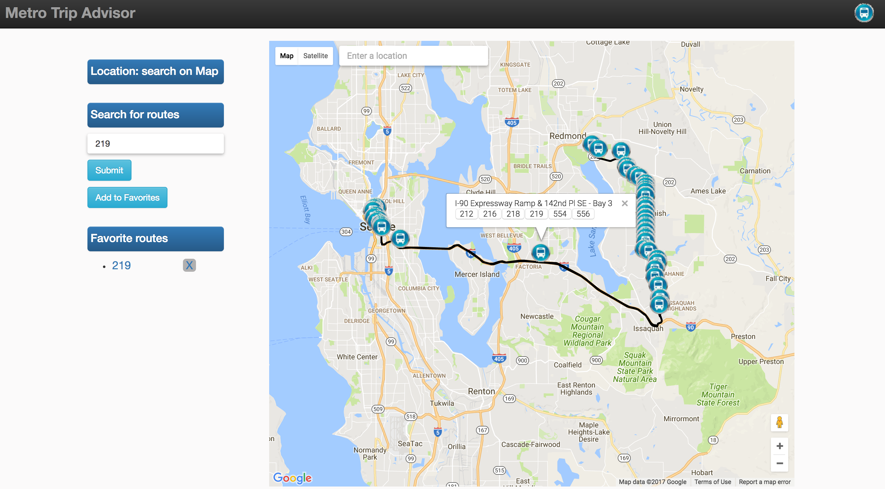

# Metro Trip Advisor

Search route to find its stops, and discover all routes for given stop. Zoom into the map to see stops nearby a specific location.

Check it out for yourself - [Metro Trip Advisor](https://metro-trip-advisor.herokuapp.com/)!

## Why?

To provide an easy interface for individuals to travel easy.

## Install

```sh
npm install
cd client
npm install
cd ..
npm start
```

## Key Technologies

* React
* Node
* Express
* PostgreSQL
* Bootstrap
* HTML, CSS, JavaScript
* API: [OneBusAway API](http://developer.onebusaway.org/modules/onebusaway-application-modules/current/api/where/index.html)

## Steps
* Found an API that we could query and display on the page, One Bus Away was an obvious choice.
* Integrated Google Maps for data visualization.
* Displayed all bus stops for each route and incorporated a rendering of the routes along with a listing of other buses that share stops.
* Added search functionality for users to query particular destinations or landmarks on the map and our application will display all bus stops nearby.

## Contact

Built by [Congcong Li](https://www.linkedin.com/in/congcongli222/) and [Brian Bixby](https://www.linkedin.com/in/brianbixby1/)

## Metro Trip Advisor

